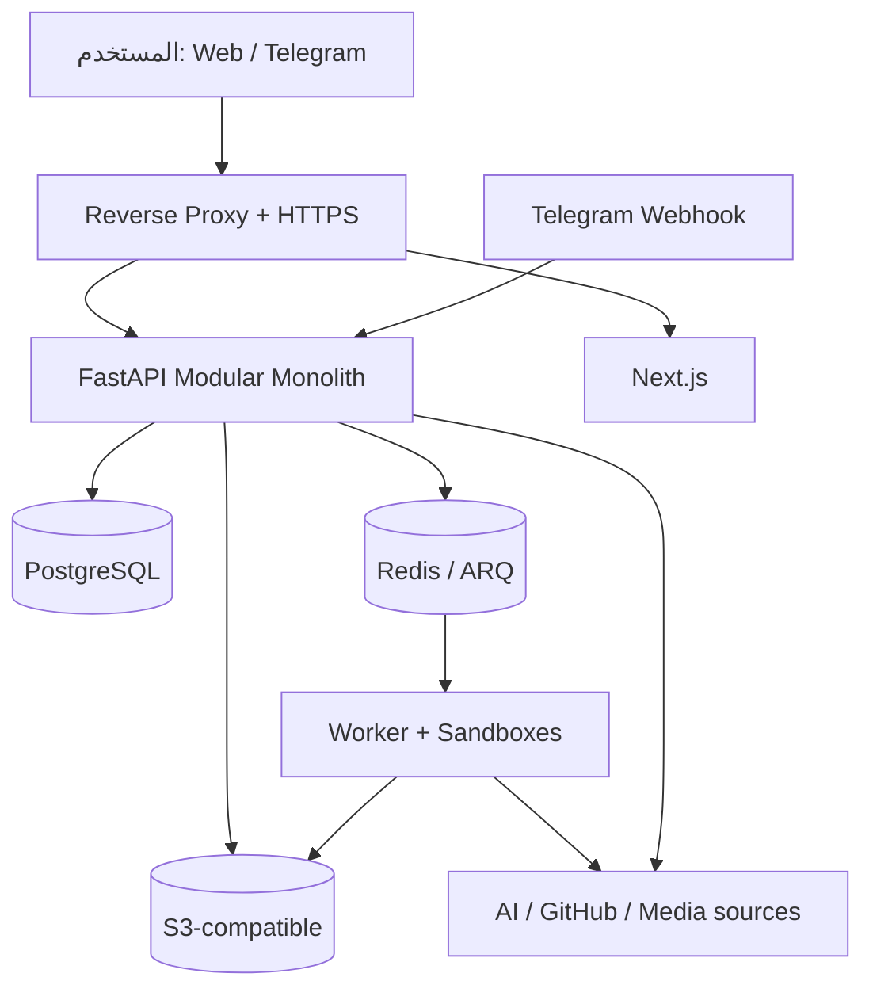

# المعمارية

## القرار الأساسي

نعتمد **Monorepo + Modular Monolith**: تطبيق FastAPI واحد بوحدات نطاق واضحة، بوت aiogram رقيق، Worker مستقل بـARQ، وNext.js للويب. هذا يقلل كلفة التشغيل والمعاملات الموزعة الآن، مع إبقاء العقود والـAdapters قابلة للاستخراج إلى خدمات لاحقاً.

اخترنا **ARQ** لأنه async-native، خفيف، ويلائم FastAPI/Redis ومهام I/O. حالة العمل التجارية لا تعتمد على Redis وحده؛ تسجل في PostgreSQL قبل enqueue، ويستعيد reconciler المهام المتوقفة بعد الأعطال.

## العرض العام



## المكونات

| المكون | المسؤولية |
|---|---|
| `apps/api` | HTTP/SSE/Webhook، auth، سياسات الوصول، orchestration |
| `apps/bot` | routers/keyboards/FSM؛ يستدعي طبقة التطبيق ولا يحمل منطقاً حساساً |
| `apps/worker` | ARQ jobs، media، agent sandbox، retries، cleanup |
| `apps/web` | واجهة RTL، TanStack Query، SSE، الموافقات والإدارة |
| `packages/core` | الأنواع والسياسات وأخطاء النطاق |
| `packages/integrations` | AI/GitHub/DB/S3 adapters |
| `packages/observability` | logging/metrics/tracing/redaction |
| `infrastructure` | Docker، proxy، monitoring، manifests |

## حدود الوحدات

الوحدات: `auth`, `users`, `telegram`, `ai_providers`, `conversations`, `agents`, `github_integrations`, `database_integrations`, `media`, `files`, `jobs`, `quotas`, `admin`, `audit`, `settings`.

كل وحدة تتبع:

```text
domain/          كيانات وقواعد بلا اعتماد على FastAPI أو SQLAlchemy
application/     use cases وports والمعاملات
infrastructure/  SQLAlchemy وAdapters خارجية
presentation/    API schemas/routes أو bot handlers
```

لا تستورد وحدة جداول وحدة أخرى مباشرة لتنفيذ منطقها؛ تستخدم Application service أو event داخلياً. المعاملات المحلية تمر عبر Unit of Work.

## العقود الخارجية

- `BaseAIProvider`: `test_connection`, `list_models`, `stream_chat`, capabilities، وتوحيد الأخطاء.
- `ObjectStorage`: put/get/delete/presign.
- `GitHubGateway`: OAuth/App installations، repo/branch/commit/PR.
- `SandboxRunner`: create/exec/archive/destroy مع limits وسياسة شبكة.
- `MediaDownloader` و`MediaProcessor`: طبقة فوق yt-dlp وFFmpeg.
- `SecretCipher`: envelope-style API؛ MVP يستخدم AEAD بمفتاح رئيسي من البيئة.

## تدفق الطلبات والمهام

العمليات السريعة تنفذ داخل API. العملية الثقيلة:

1. يتحقق API من الهوية والحصة وidempotency.
2. ينشئ `background_jobs` داخل معاملة.
3. يرسل معرف المهمة إلى ARQ بعد commit.
4. يقفل Worker السجل، يحدث heartbeat/progress، ويحفظ المخرجات.
5. يرسل التقدم عبر Redis pub/sub؛ SSE يعيد الاتصال ويقرأ آخر حالة من PostgreSQL.
6. reconciler يعيد إدراج `queued` أو `running` بلا heartbeat وفق السياسة.

## Streaming

SSE هو الخيار الافتراضي لمحادثات AI وتقدم المهام لأنه أحادي الاتجاه، يعبر الـproxies بسهولة، ويدعم الاستكمال بـ`Last-Event-ID`. WebSocket يؤجل حتى تظهر حاجة ثنائية الاتجاه. الإلغاء endpoint منفصل يضبط cancellation token في Redis وحالة دائمة في PostgreSQL.

## حدود الأمن

- **Edge:** HTTPS، حد حجم الطلب، rate limit وTelegram secret validation.
- **Application:** JWT قصيرة + refresh cookie HttpOnly/Secure، RBAC وownership checks.
- **Secrets:** AEAD، masking، منع التسجيل، ودوران credential؛ المفتاح الرئيسي لا يدخل DB.
- **Egress:** custom Base URL يمر بحل DNS آمن؛ يحظر loopback/private/link-local/metadata، ويعاد التحقق بعد redirects.
- **Agent:** container مؤقت non-root، filesystem منفصل، CPU/RAM/disk/time limits، egress allowlist، والأدوات allowlisted بلا shell interpolation.
- **Approvals:** push/merge/destructive migration/production deploy/secret change لا تنفذ قبل موافقة مرتبطة بـhash للعملية.
- **Data:** owner scoping في repositories؛ يمكن تفعيل PostgreSQL RLS كدفاع إضافي بعد تثبيت transaction context.

## المراقبة

JSON logs منقحة تحمل `request_id`, `correlation_id`, `user_id` المموه، و`job_id`. Prometheus يجمع latency/error/queue/provider/media/webhook metrics. OpenTelemetry وSentry اختياريان ولا يرسلان prompt أو headers افتراضياً.

## شجرة المشروع المستهدفة

```text
.
├── apps/
│   ├── api/src/platform/{modules,shared,main.py}
│   ├── bot/src/bot/{handlers,keyboards,middlewares}
│   ├── worker/src/worker/{jobs,sandbox,main.py}
│   └── web/{app,components,lib}
├── packages/
│   ├── core/
│   ├── integrations/
│   └── observability/
├── migrations/
├── infrastructure/
│   ├── docker/
│   ├── nginx/
│   └── monitoring/
├── scripts/
├── tests/{unit,integration,e2e,fixtures}
├── docs/
└── .github/workflows/
```

قد يبدأ التنفيذ الحالي بهيكل Next.js قائم؛ ينقل تدريجياً إلى هذه الشجرة من دون كسر نسخة قابلة للتشغيل.

