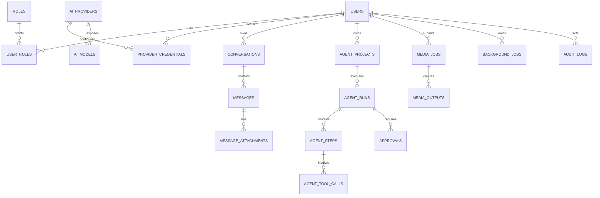

# تصميم قاعدة البيانات

## مبادئ

- PostgreSQL هو مصدر الحقيقة، وRedis للطوابير والقفل والتقدم اللحظي لا للسجل الدائم.
- UUIDv7/UUID كمعرفات، و`created_at`, `updated_at` UTC، و`deleted_at` حيث يلزم الاسترجاع.
- الأسرار تخزن كـciphertext + nonce/version/key fingerprint، ولا تخزن في JSONB.
- JSONB للبيانات المتغيرة فعلاً مثل capabilities وmetadata المنقحة، لا بديلاً للعلاقات.
- الحذف المقيد للتدقيق والتكاملات؛ cascade فقط للتوابع غير المستقلة مثل attachments.

## مخطط الكيانات الأساسي

## الكيانات والقيود المهمة

| الجدول | حقول أساسية وقيود |
|---|---|
| `users` | `id`, status, locale, timezone؛ index على status |
| `telegram_accounts` | `user_id`, `telegram_user_id UNIQUE`, username؛ لا cascade تدقيقياً |
| `user_sessions` | refresh token hash، device، expires/revoked؛ index `(user_id, expires_at)` |
| `roles`, `permissions` | `name UNIQUE`؛ join tables بمفاتيح مركبة |
| `ai_providers` | adapter_type، base_url، enabled، capabilities JSONB |
| `user_provider_credentials` | `(user_id, provider_id, name) UNIQUE`، ciphertext وmasked_suffix |
| `ai_models` | `(provider_id, external_id) UNIQUE`، context_window، capability flags، pricing |
| `conversations` | owner، title، default model، system instructions، archived_at |
| `messages` | conversation، parent/branch، role، status، content، model snapshot، provider request id |
| `message_attachments` | message، stored_file، media_type، processing status |
| `usage_records` | user/provider/model/message، input/output tokens، estimated cost؛ فهارس زمنية |
| `agent_projects` | owner، workspace policy، repo allowlist، status |
| `agent_runs` | project، plan، status، max_steps/runtime/budget، cancellation token hash |
| `agent_steps` | run، ordinal، role، status، input/output المنقح؛ `UNIQUE(run_id, ordinal)` |
| `agent_tool_calls` | step، tool، args/result منقحة، permission decision، duration |
| `approvals` | run، operation hash، impact، status، requester/approver، expiry |
| `github_connections` | owner، installation/account، encrypted token، scopes، expiry |
| `github_repositories` | connection، repo id/full_name، allowlisted، permission snapshot |
| `database_connections` | owner/project، engine، encrypted DSN، mode، policy |
| `media_jobs` | owner، source URL hash، requested operation، status، progress، limits |
| `media_outputs` | job، stored_file، format، duration/size/checksum |
| `stored_files` | owner، storage key، checksum، size، content type، expires_at |
| `background_jobs` | type، owner/project، status، progress/stage، retry/heartbeat/idempotency |
| `subscriptions`, `quotas` | plan/user، metric، limit/period/usage |
| `notifications` | user، channel، template، status/read_at |
| `audit_logs` | actor، action، target، outcome، IP hash، metadata منقحة؛ append-only |
| `system_settings`, `feature_flags` | typed value/version، scope، updated_by |

## الحالات

الحالة الموحدة للمهام:

`queued → running → completed`

ومسارات: `waiting_for_approval`, `retrying`, `failed`, `cancelled`, `timed_out`. الانتقالات تتحقق في domain service، ولا يسمح للعامل بتجاوزها مباشرة.

## فهارس وسلامة

- `(owner_user_id, created_at DESC)` على موارد المستخدم.
- `(status, priority DESC, created_at)` على `background_jobs`.
- partial index للمهام `queued/running/retrying`.
- `(conversation_id, created_at, id)` للpagination بالمؤشر.
- `(expires_at)` على الملفات والجلسات والموافقات لأعمال التنظيف.
- `idempotency_key UNIQUE` ضمن نوع المهمة/المالك.
- checks: progress بين 0 و100، token counts غير سالبة، ونهاية المقطع بعد بدايته.

## الترحيلات والـSeed

Alembic هو المرجع الوحيد لتغييرات schema. يضيف Seed آمن للأدوار والصلاحيات والإعدادات العامة دون حساب admin افتراضي أو أسرار. إنشاء أول admin يتم بأمر إداري صريح ومعرف Telegram.

## RLS والنسخ الاحتياطي

يطبق عزل المالك في repository layer منذ البداية. يمكن تفعيل RLS للجداول عالية الحساسية (`credentials`, `connections`, `projects`, `files`) بعد ضبط `app.user_id` محلياً لكل transaction. النسخ الاحتياطي الدوري بـ`pg_dump` واختبار restore؛ كائنات S3 لها lifecycle ونسخ/تشفير حسب المزود.

