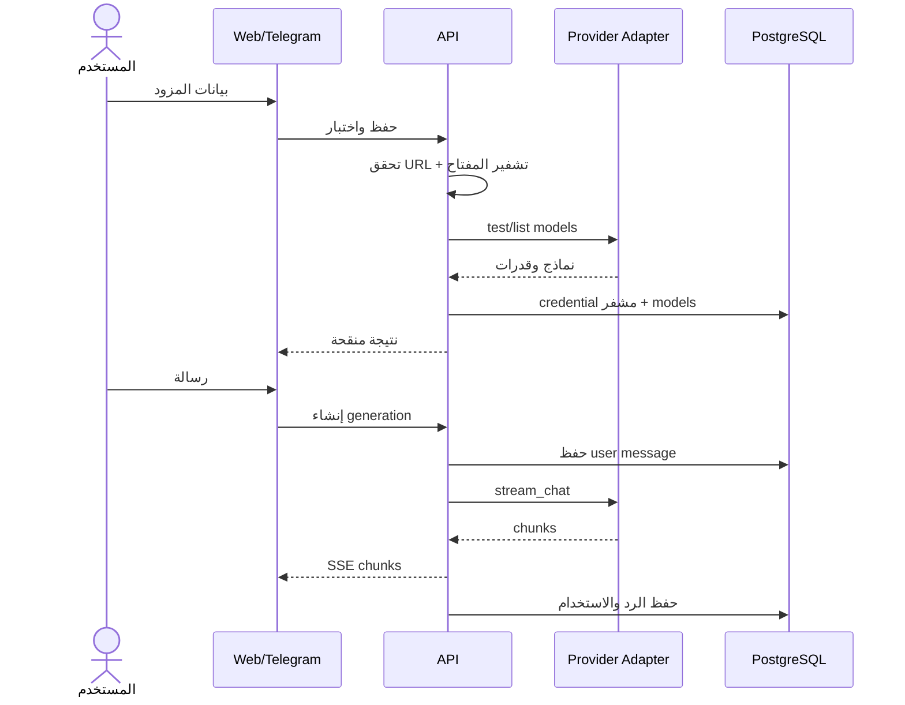
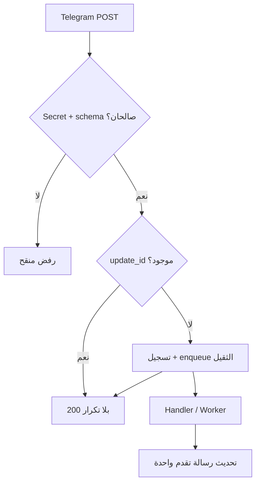
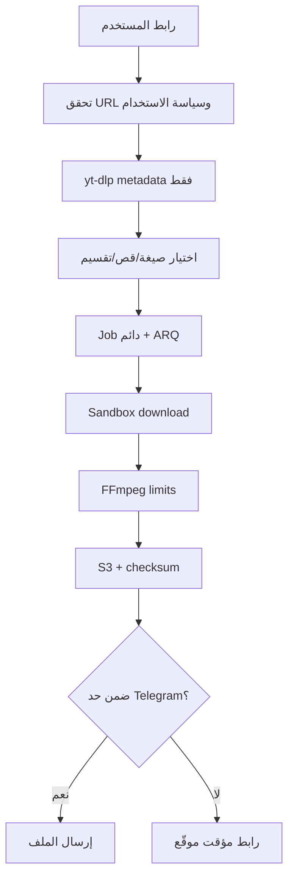
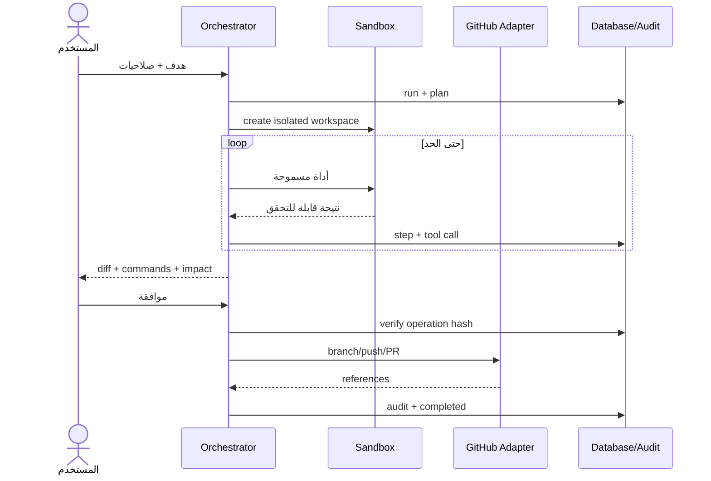

# تدفقات الاستخدام

## 1. إضافة مزود وبدء محادثة

إن فشل listing يسمح بإدخال model id يدوياً. الإلغاء يوقف stream قدر الإمكان ويثبت الرسالة `cancelled` دون ادعاء توقف فاتورة المزود فوراً.

## 2. Telegram Webhook

التحديثات الخفيفة تعالج بسرعة، والثقيلة تسجل كمهام. callback data يحمل معرفاً قصيراً وتوقيعاً، لا أسراراً.

## 3. تنزيل ومعالجة وسائط

كل مرحلة تفحص الإلغاء والحصة. الملفات المؤقتة تحذف في `finally`، والمخرجات وفق retention. لا DRM ولا محتوى خاص أو مدفوع.

## 4. تشغيل وكيل وموافقة حساسة

أي تغير في diff أو الهدف يبطل الموافقة. الرفض يبقي workspace والنتائج حسب retention، ولا ينفذ الأثر الخارجي.

## 5. الإدارة والحصص

Admin endpoints تجمع من جداول الاستخدام والمهام والتدقيق، ومن Prometheus للصحة التشغيلية. الحظر أو تعديل الحصة عملية مدققة. إعادة المحاولة تنشئ attempt جديداً مرتبطاً بالأصل مع idempotency مستقل؛ لا يعاد تنفيذ أثر خارجي مكتمل.

## 6. الدخول للويب

Telegram Login/WebApp `initData` يتحقق بتوقيع Telegram وتاريخ المصادقة قبل إنشاء session. يصدر access JWT قصير في الذاكرة وrefresh token عشوائي كـHttpOnly Secure SameSite cookie، ولا يخزن refresh raw بل hash. GitHub OAuth منفصل عن جلسة المنصة ويستخدم state + PKCE حيث ينطبق.

